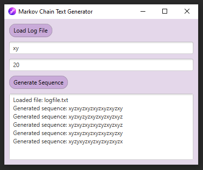

## Markov Text Generator

Projekt jest prostą implementacją pseudolosowego procesu - generacji tekstu na podstawie łańcucha Markowa, opartego na propozycji projektu z Princeton University.
Aplikacja wykorzystuje JavaFX do budowy graficznego interfejsu użytkownika (GUI).

### Klasa TMarkov

Klasa `TMarkov` zawiera logikę niezbędną do generowania tekstu na podstawie łańcucha Markowa.
Znajduje się w niej implementacja metod do wczytywania tekstu z pliku, budowy łańcucha Markova, oraz generowania nowego tekstu na podstawie zadanego początkowego fragmentu (k-event).

### Klasa TMain

Klasa `TMain` stanowi GUI aplikacji. Zawiera prosty interfejs z polami do wprowadzenia danych wejściowych (początkowego fragmentu k-event i długości generowanego tekstu) oraz przyciskami do obsługi akcji wczytywania pliku i generowania tekstu.

### Prerequisites

- [IntelliJ IDEA](https://www.jetbrains.com/idea/download/download-thanks.html?platform=windows&code=IIC)
- [Java 21](https://www.oracle.com/pl/java/technologies/downloads/#jdk21-windows)
- [JavaFX w wersji 21.x](https://gluonhq.com/products/javafx/)

### Konfiguracja

Przed pierwszym uruchomieniem aplikacji, wykonaj następujące kroki w IntelliJ IDEA:

1. Przejdź do menu Run -> Edit Configurations -> Add VM options.
3. W polu "VM options" wklej: `--module-path <ścieżka do folderu 'lib' pobranego JavaFX SDK> --add-modules=javafx.controls` wstawiając swoją ścieżkę do SDK JavaFX.
4. Zapisz zmiany i uruchom metodę `TMain.main()`.

### Korzystanie z aplikacji

Po uruchomieniu `TMain.main()`, postępuj zgodnie z poniższymi krokami:

1. **Wczytanie pliku**: Kliknij przycisk "Load Log File" i wybierz plik tekstowy zawierający łańcuch znaków. Możesz użyć przykładowego pliku `logfile.txt` zlokalizowanym w `src/main/resources/markov/logfile.txt` lub dowolnego innego pliku tekstowego.

2. **Wprowadzenie danych wejściowych**: Wprowadź początkowy fragment tekstu (k-event) oraz żądaną długość wygenerowanego tekstu do odpowiednich pól tekstowych.

3. **Generowanie tekstu**: Kliknij przycisk "Generate Sequence" aby wygenerować tekst na podstawie wprowadzonych danych. Wygenerowany tekst pojawi się w polu poniżej.

